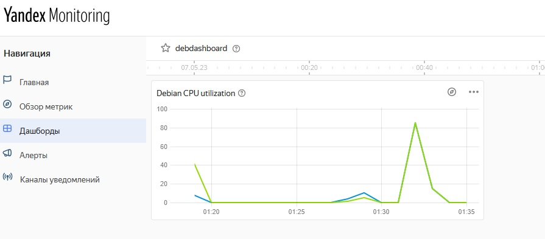
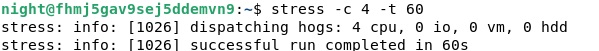
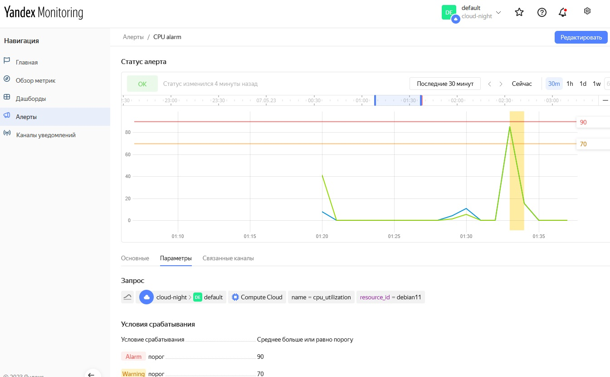
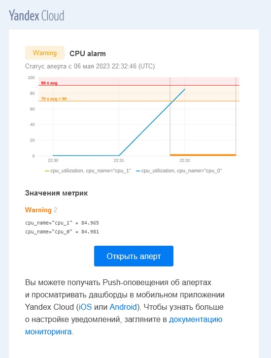

# Обзор систем IT-мониторинга
## Домашнее задание. Горбунов Владимир

## Цели задания
1. Научиться запускать мониторинг ИТ-системы через Yandex Monitoring
2. Научиться настраивать уведомления о событиях в процессе мониторинга через e-mail

## Содержание
- [Задание 1. Создание ВМ c мониторингом в Yandex Cloud](#Задание-1)
>Создайте виртуальную машину в Yandex Compute Cloud и с помощью Yandex Monitoring создайте дашборд, на котором будет видно загрузку процессора.
- [Задание 2. Алерты в яндекс мониторинге](#Задание-2)  
>С помощью Yandex Monitoring сделайте 2 алерта на загрузку процессора: WARN и ALARM. Создайте уведомление по e-mail.


## Задание 1
Создание ВМ c мониторингом в Yandex Cloud

- Создание ВМ, дашборда и подключение мониторинга Unified Agent решил автоматизировать и выполнить с помощью терраформа.
Файл конфигурации терраформа:

[main.tf](main.tf)

- Unified agent устанавливается передачей метаданных при создании машины, запускается шелскрипт для его установки:
```
#cloud-config\nruncmd:\n  - 'wget -O - https://monitoring.api.cloud.yandex.net/monitoring/v2/unifiedAgent/config/install.sh | bash'
```
- Дашборд:


## Задание 2
Алерты в яндекс мониторинге

- Машина нагружена с помощью утилиты stress:



- Отображение в панели:



- Уведомление на почте:

